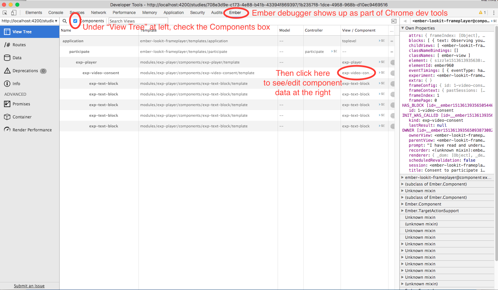
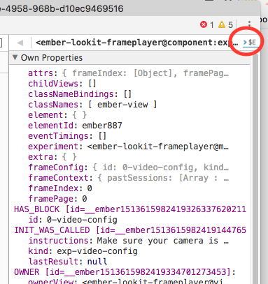

# Development: Custom Frames

### Overview

You may find you have a need for some experimental component is not included in Lookit already. The goal of this
section is to walk through extending the base functionality with your own code.

We use the term 'frame' to describe the combination of JavaScript file and Handlebars HTML template that compose a
**block** of an experiment (see "Building your experiment").

Experimenter is composed of three main modules:

- **[lookit-api](https://github.com/CenterForOpenScience/lookit-api)**: The repo containing the Experimenter Django app.  The Lookit Django app is also in this repo.
- **[ember-lookit-frameplayer](https://github.com/CenterForOpenScience/ember-lookit-frameplayer)**: A small Ember app that allows the API in lookit-api to talk to the exp-player
- **[exp-player](https://github.com/CenterForOpenScience/exp-addons/tree/develop/exp-player)**: the built-in rendering engine for experiments built in Experimenter.  Contained in exp-addons.

Generally, all 'frame' development will happen in the exp-player module. By nature of the way the ember-lookit-frameplayer
repository is structured, this will mean making changes in the `ember-lookit-frameplayer/lib/exp-player` directory. These changes
can be committed as part of the [exp-addons](https://github.com/lookit/exp-addons) git submodule
(installed under `ember-lookit-frameplayer/lib`). 

To start developing your own frames, you will want to first follow the "Setup for local frame development" steps. 
To use the frame definitions you have created when posting a study on Lookit, you can specify your own exp-addons repo to use (see "Using the experimenter interface"). 

### Getting Started

One of the features of [Ember CLI](http://www.ember-cli.com/) is the ability to provide 'blueprints' for code. These
are basically just templates of all of the basic boilerplate needed to create a certain piece of code. To begin
developing your own frame:

```bash
cd ember-lookit-frameplayer/lib/exp-player
ember generate exp-frame exp-<your_name>
```

Where `<your_name>` corresponds with the frame name of your choice.

#### A Simple Example

Let's walk though a basic example of 'exp-consent-form':

```bash
$ ember generate exp-frame
installing exp-frame
  create addon/components/exp-consent-form/component.js
  create addon/components/exp-consent-form/template.hbs
  create app/components/exp-consent-form.js
```

Notice this created three new files:
- `addon/components/exp-consent-form/component.js`: the JS file for your 'frame'
- `addon/components/exp-consent-form/template.hbs`: the Handlebars template for your 'frame'
- `app/components/exp-consent-form.js`: a boilerplate file that exposes the new frame to the Ember app-
  you will almost never need to modify this file.

Let's take a deeper look at the `component.js` file:

```javascript
import ExpFrameBaseComponent from 'exp-player/components/exp-frame-base/component';
import layout from './template';

export default ExpFrameBaseComponent.extend({
    type: 'exp-consent-form',
    layout: layout,
    meta: {
        name: 'ExpConsentForm',
        description: 'TODO: a description of this frame goes here.',
        parameters: {
            type: 'object',
            properties: {
                // define configurable parameters here
            }
        },
        data: {
            type: 'object',
            properties: {
                // define data to be sent to the server here
            }
        }
    }
});
```

The first section:

```javascript
import ExpFrameBaseComponent from 'exp-player/components/exp-frame-base';
import layout from './template';

export default ExpFrameBaseComponent.extend({
    type: 'exp-consent-form',
    layout: layout,
...
})
```

does several things:
- imports the `ExpFrameBaseComponent`: this is the superclass that all 'frames' must extend
- imports the `layout`: this tells Ember what template to use
- extends `ExpFrameBaseComponent` and specifies `layout: layout`


Next is the 'meta' section:

```javascript
    ...
    meta: {
        name: 'ExpConsentForm',
        description: 'TODO: a description of this frame goes here.',
        parameters: {
            type: 'object',
            properties: {
                // define configurable parameters here
            }
        },
        data: {
            type: 'object',
            properties: {
                // define data to be sent to the server here
            }
        }
    }
...
```

which is composed of:
- name (optional): A human readable name for this 'frame'
- description (optional): A human readable description for this 'frame'.
- parameters: JSON Schema defining what configuration parameters this 'frame' accepts. When you define an experiment
  that uses the frame, you will be able to specify configuration as part of the experiment definition. Any parameters in
  this section will be automatically added as properties of the component, and directly accessible as `propertyName` from
  templates or component logic.
- data: JSON Schema defining what data this 'frame' outputs. Properties defined in this section represent properties of
  the component that will get serialized and sent to the server as part of the payload for this experiment. You can get
  these values by binding a value to an input box, for example, or you can define a custom computed property by that
  name to have more control over how a value is sent to the server.  

If you want to save the value of a configuration variables, you can reference it in both parameters *and* data.
For example, this can be useful if your experiment randomly chooses some frame behavior when it loads for the user, and
you want to save and track what value was chosen.

#### Building out the Example

Let's add some basic functionality to this 'frame'. First define some of the expected parameters:

```javascript
...
    meta: {
        ...,
        parameters: {
            type: 'object',
            properties: {
                title: {
                    type: 'string',
                    default: 'Notice of Consent'
                },
                body: {
                    type: 'string',
                    default: 'Do you consent to participate in this study?'
                },
                consentLabel: {
                    type: 'string',
                    default: 'I agree'
                }
            }
        }
    },
...
```

And also the output data:

```javascript
...,
    data: {
        type: 'object',
            properties: {
                consentGranted: {
                    type: 'boolean',
                    default: false
                }
            }
        }
    }
...
```

Since we indicated above that this 'frame' has a `consentGranted` property, let's add it to the 'frame' definition:

```javascript
export default ExpFrameBaseComponent.extend({
    ...,
    consentGranted: null,
    meta: {
    ...
    }
...
```


Next let's update `template.hbs` to look more like a consent form:

```
<div class="well">
  <h1>{{ title }}</h1>
  <hr>
  <p> {{ body }}</p>
  <hr >
  <div class="input-group">
    <span>
      {{ consentLabel }}
    </span>
    {{input type="checkbox" checked=consentGranted}}
  </div>
</div>
<div class="row exp-controls">
  <!-- Next/Last/Previous controls. Modify as appropriate -->
  <div class="btn-group">
    <button class="btn btn-default" {{ action 'previous' }} > Previous </button>
    <button class="btn btn-default pull-right" {{ action 'next' }} > Next </button>
  </div>
</div>
```

We don't want to let the participant navigate backwards or to continue unless they've checked the box, so let's change the footer to:

```
<div class="row exp-controls">
  <div class="btn-group">
    <button class="btn btn-default pull-right" disabled={{ consentNotGranted }} {{ action 'next' }} > Next </button>
  </div>
</div>
```

Notice the new property `consentNotGranted`; this will require a new computed field in our JS file:

```javascript
    meta: {
        ...
    },
    consentNotGranted: Ember.computed.not('consentGranted')
});
```

### Tips and tricks

#### YUIdoc documentation

We use [YUIdoc](http://yui.github.io/yuidoc/) for generating "automatic" documentation of  exp-addons frames, available [here](http://centerforopenscience.github.io/exp-addons/modules/frames.html). If you want to contribute your frames to the main Lookit codebase, please include YUIdoc-formatted comments following the example of existing frames, e.g. `exp-exit-survey` or `exp-lookit-geometry-alternation`. Make sure to include:

* A general description of your frame
* An example of using it (the relevant JSON for a study)
* All inputs
* All outputs (data saved)
* Any events recorded

#### Ember debugging

Values of variables used in your frame are tricky to access directly from the Javascript console in your browser during testing. 

There's an [Ember Inspector browser plugin](https://guides.emberjs.com/v2.11.0/ember-inspector/) you can use to help debug the Lookit components. Once you've installed it, you'll find it along with other developer tools.

Here's how to find relevant data for a particular frame. Screenshots below are for Google Chrome.



This lets you right away change any of the data you sent to the frame in the JSON document. E.g., on the consent page, try changing the "prompt" to something else. If something is going wrong, hopefully this information will be helpful.

You can send the entire component (or anything else) to the console using the little >$E button:



And then to keep using it, save it as a variable:


Then you can do things like try out actions, e.g. `this.send`.

#### Tips for adding styles
You will probably want to add custom styles to your frame, in order to control the size, placement, and color of
elements. Experimenter uses a common web standard called [CSS](https://developer.mozilla.org/en-US/docs/Web/CSS) for
styles.*

To add custom styles for a pre-existing component, you will need to create a file `<component-name.scss>` in the
`addon/styles/components` directory of `exp-addons`. Then add a line to the top of `addon/styles/addon.scss`, telling
it to use that style. For example,

`@import "components/exp-video-physics";`

Remember that anything in exp-addons is shared code: the .scss files you write will be applied across all frames of any study that uses your version of exp-addons. Especially if you intend to maintain a lab exp-addons that contains frames useful to you to be used across multiple studies, or you envision others building on your work by using your frames, you should follow the tips below to write styles that will stay isolated and avoid unintended consequences: 
- Do not override global styles, or things that are part of another component. For example, `exp-video-physics` should
not contain styles for `exp-player`.
	- If you do need to style an element specifically inside that component, either add a second style to the element, or consider using nested [CSS selectors](https://developer.mozilla.org/en-US/docs/Learn/CSS/Introduction_to_CSS/Selectors).
- Give all of the styles in your component a unique common name prefix, so that they don't inadvertently overlap with
styles for other things. For example, instead of `some-video-widget`, consider a style name like `exp-myframe-video-widget`.
- Target each of your CSS rules at elements that match a unique class (e.g. `exp-myframe`) you give to a wrapper for your frame template, in addition to whatever substantive selectors you need.

\* You may notice that style files have a special extension `.scss`. That is because styles in experimenter are
actually written in [SASS](http://sass-lang.com/). You can still write normal CSS just fine, but SASS provides
additional syntax on top of that and can be helpful for power users who want complex things (like variables).

#### When should I use actions vs functions?
Actions should be used when you need to trigger a specific piece of functionality via user interaction: eg click a
button to make something happen.

Functions (or helper methods on a component/frame) should be used when the logic is shared, or not intended to be
accessed directly via user interaction. It is usually most convenient for these methods to be defined as a part of the
component, so that they can access data or properties of the component. Since functions can return a value, they are
particularly helpful for things like sending data to a server, where you need to act on success or failure in order to
display information to the user. (using promises, etc)

Usually, you should use actions only for things that the user directly triggers. Actions and functions are not mutually
exclusive! For example, an action called `save` might call an internal method called `this._save` to handle the
behavior and message display consistently.

If you find yourself using the same logic over and over, and it does not depend on properties of a particular
 component, consider making it a [util](https://ember-cli.com/extending/#detailed-list-of-blueprints-and-their-use)!

If you are building extremely complex nested components, you may also benefit from reading about closure actions. They
can provide a way to act on success or failure of something, and are useful for :
- [Ember closure actions have return values](https://alisdair.mcdiarmid.org/ember-closure-actions-have-return-values/)
- [Ember.js Closure Actions Improve the Former Action Infrastructure](https://spin.atomicobject.com/2016/06/25/emberjs-closure-actions/)
